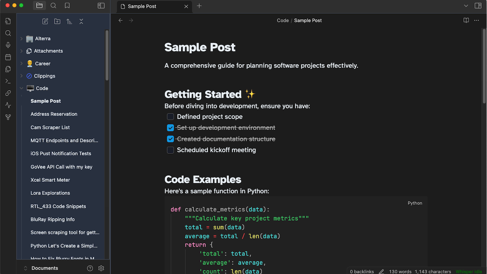

# **Frost** 
## An clean obsidian theme meant to get out of your way

There are so many great Obsidian themes out there but non matched exactly what I was looking for so I did what anyone would do and made my own featuring light and dark modes. Loosely inspired by Apple Notes and Tailwinds default theming.

## Screenshots

>A recipe. Images have rounded corners

> A sample to-do list and some headings and code samples.

> Some sample Links, Tables and Quotes

> Dark Mode Example

## Plugins Used
Some plugs I use to get some of these effects IE the Icons and Code sampling are:

* [Code Block](obsidian://show-plugin?id=code-block-plugin)
* [Iconize](obsidian://show-plugin?id=obsidian-icon-folder)

## Base Theme Fonts and Colors
This theme supports you choosing your own fonts and acceent color but if you want to match these screen shots exactly use the following

#### Accent Color
R: 14 G: 165 B: 233

#### Interface Font
SF Pro Display

#### Text Font
Atkinson Hyperlegible

#### Monospaced Font
JetBrains Mono

### Font Size
18

This is my first theme, and if you have suggestions for improvement please let me know and I look forward to learning more.