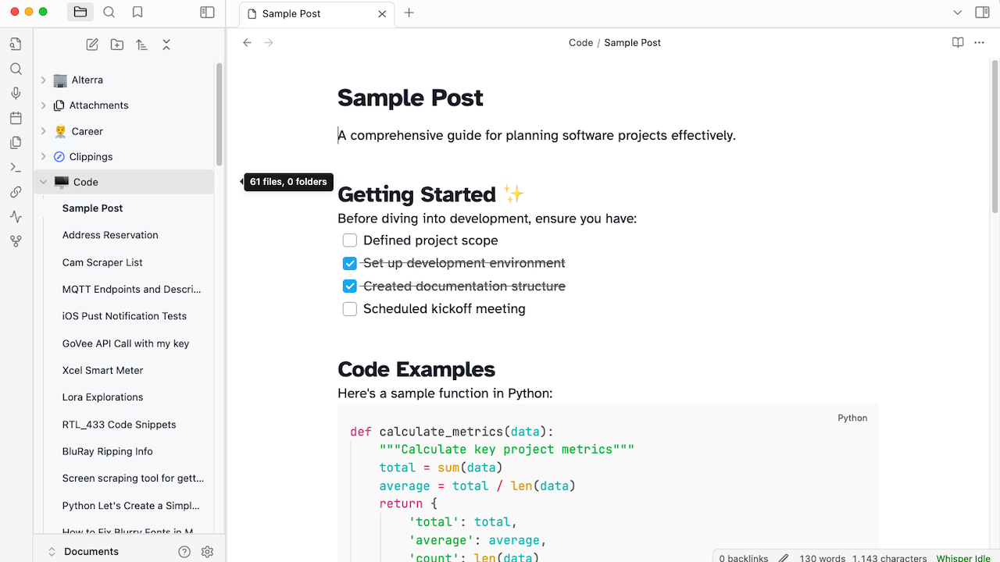
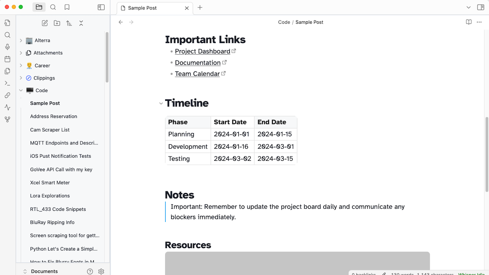

# **Frost** 
## A clean obsidian theme meant to get out of your way

A minimalist Obsidian theme that stays out of your way, featuring both light and dark modes. Inspired by Apple Notes and Tailwind's default theming.

## Features

- Clean, distraction-free interface
- Light and dark mode support
- Rounded corners for images
- Carefully chosen typography
- Customizable accent colors

## Screenshots

>A recipe note showcasing rounded image corners

> A sample to-do list and some headings and code samples.

> Some sample Links, Tables and Quotes

> Dark Mode Example

## Default Configuration

### Theme Settings
- **Accent Color**: RGB(14, 165, 233)
- **Default Font Size**: 18px

### Font Stack
- **Interface**: SF Pro Display
- **Text**: Atkinson Hyperlegible
- **Monospace**: JetBrains Mono

## Required Plugins
To achieve the full experience shown in the screenshots, the following plugins are recommended:

- [Code Block](obsidian://show-plugin?id=code-block-plugin)
- [Iconize](obsidian://show-plugin?id=obsidian-icon-folder)

## Customization
While the theme comes with carefully selected defaults, you can customize:
- Accent colors
- Interface and text fonts
- Font sizes
- And more through Obsidian's appearance settings

## Feedback and Support

This is my first Obsidian theme, and I'm actively working on improvements. If you have suggestions or encounter any issues, please feel free to:
- Open an issue on GitHub
- Submit a pull request
- Share your feedback

## Support My Work

If you enjoy this theme and want to support its development, you can buy me a coffee:

